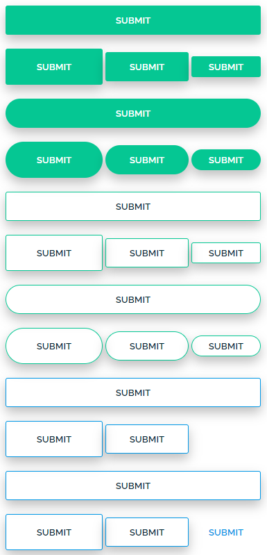

# button-styler

This script is a simple tool to stylize the HTML button tags based on their classes.

## HTML code example:

```
<button class="btn btn-green">Submit</button>

<button class="btn btn-green btn-rounded">Submit</button>

<button class="btn btn-border-green btn-rounded">Submit</button>

<button class="btn btn-green btn-small">Submit</button>

<button class="btn btn-green btn-small btn-rounded">Submit</button>

<button class="btn btn-border-green btn-small btn-rounded">Submit</button>

<button class="btn btn-red">Submit</button>

<button class="btn btn-red btn-rounded">Submit</button>

<button class="btn btn-border-red btn-rounded">Submit</button>

<button class="btn btn-red btn-small">Submit</button>

<button class="btn btn-red btn-small btn-rounded">Submit</button>

<button class="btn btn-border-red btn-small btn-rounded">Submit</button>
```

### This will display


## You can add more styles if you follow the logic of the STYLE constant

```
const STYLE = {
  // ...default style...
  'btn-pink': {
    'background-color': 'pink'
  }
}
```

## There are the following styles that you can use
**Note: the "btn" class is mandatory if you want to use the script styles.**
### Rectangular button, no edges, not round.
```
.btn-green
.btn-red
.btn-orange
.btn-blue
```
### By default no background-color, but shows the background-color when mouseover.
```
.btn-border-green
.btn-border-red
.btn-border-orange
.btn-border-blue
```
### By default, no background-color and does not show the background-color when mouseover.
```
.btn-border-simple-green
.btn-border-simple-red
.btn-border-simple-orange
.btn-border-simple-blue
```
### These can be used together with the top classes:
#### Shows a rounded button.
```
.btn-rounded
```
#### It shows a button smaller than the default.
```
.btn-small
```
## You can change the font of the letter in the STYLE constant or in the CSS:
```
.btn {
  font-family: FontName;
}
```
**or**
```
const STYLE = {
  'btn': {
    'font-family': 'FontName'
  }
}
```
## I picked up the colors from the following sites:

_https://flatuicolors.com/palette/de_

_https://coolors.co/ef476f-ffbc1f-05c793-139fcd-052b38_
